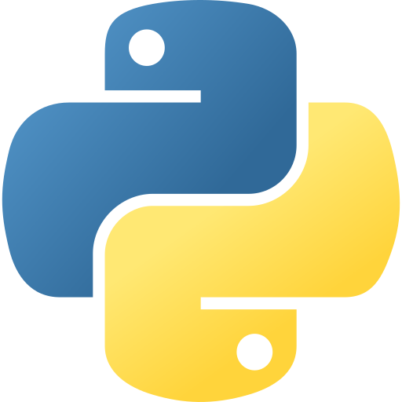

<!-- markdownlint-disable MD033 MD041 MD032 -->

  

<h2 align="center">Shakib Haris</h2>

<b>Software & Systems Engineer</b>

  <i>I design and operate secure, high-performance systems—from code to clusters.</i>

  
  
  
  
  

  
  
  

---

## 👋 About

- 🧠 **I build systems that stay fast, stay up, and stay secure**
- 🧰 **Code → clusters**: .NET + Kubernetes + automation
- 🔥 **Comfort zone**: incidents, performance, hardening, observability

- 📍 **Dhaka, Bangladesh**
- 🎯 **Infra / DevOps / Platform**
- 💻 **C# • F# • Python**
- 📈 **Reliability • Performance • Observability • Cost**

---

## ✨ What I like working on

- ⚡ **Latency & reliability** (hot paths, bottlenecks, load)
- 🔒 **Security by design** (least privilege, secure defaults)
- 📡 **Observability** (signals > noise, faster MTTR)

---

## 🚀 Featured (high-level)

- 🧱 **HA Kubernetes platform** (secure ops, predictable day-2)
- 📊 **Logging + monitoring** (Prometheus/Grafana/Elastic)
- 🌍 **Private cloud networking** (WireGuard + routing)
- 🗄️ **Distributed storage** (durability + ops tooling)

## 🧩 Open-source

- 🚚 **[Pathao Courier NopCommerce Plugin](https://github.com/skb50bd/nop-plugin-pathao-courier)**
- 🧾 **[Khata (ERP)](https://github.com/skb50bd/khata)**
- 📰 **[Scroll](https://github.com/skb50bd/scroll)**
- 🧮 **[BD Tax Calc (F#)](https://github.com/skb50bd/bxtaxcalc)**

---

## 🛠️ Stack

  
  
  
  
  
  
  
  
  
  
  
  
  
  
  
  
  
  

---

## 🤝 Contact

If you want to chat about infra/platform work:

- 📬 **Email**: [`hello@shakib.bd`](mailto:hello@shakib.bd)
- 🌐 **Website**: [`shakib.bd`](https://shakib.bd)
- 💼 **LinkedIn**: [`linkedin.com/in/skb50bd`](https://linkedin.com/in/skb50bd)

---

  <i>The best code is no code at all. The second best is code that's so simple, it obviously has no bugs.</i>
   
  Dhaka, Bangladesh

