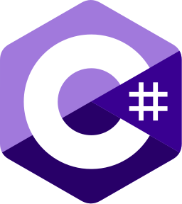
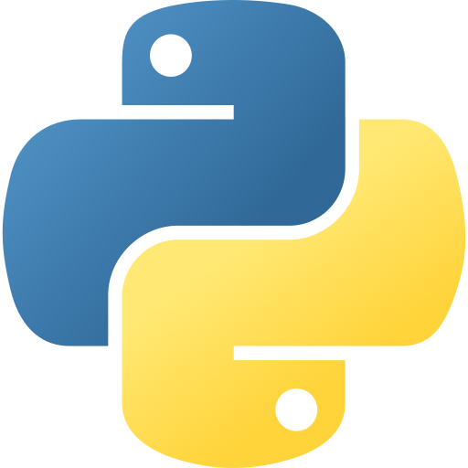
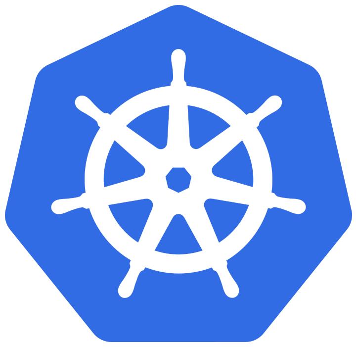
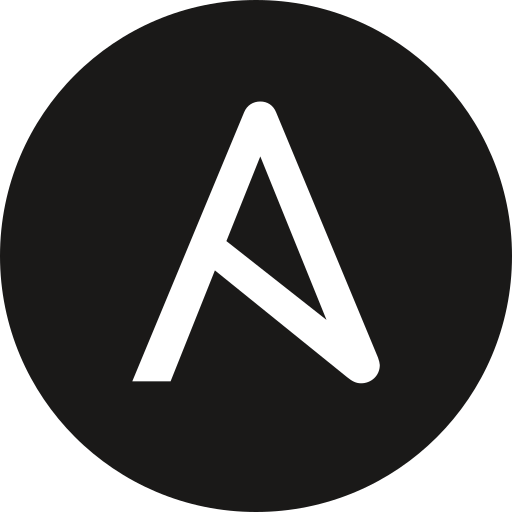
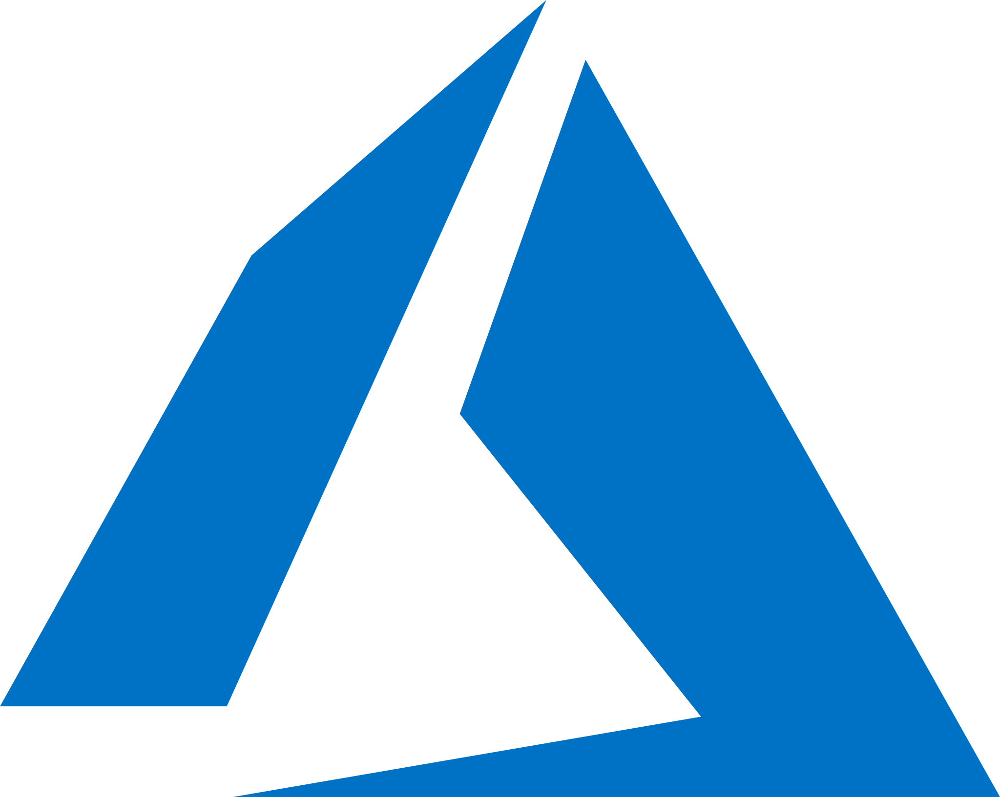
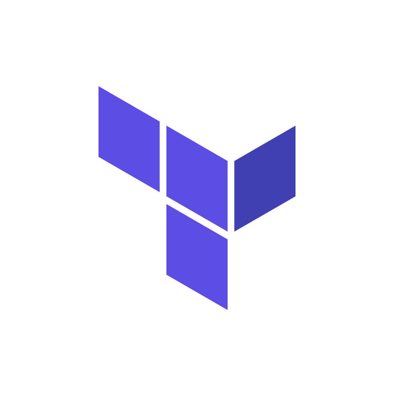
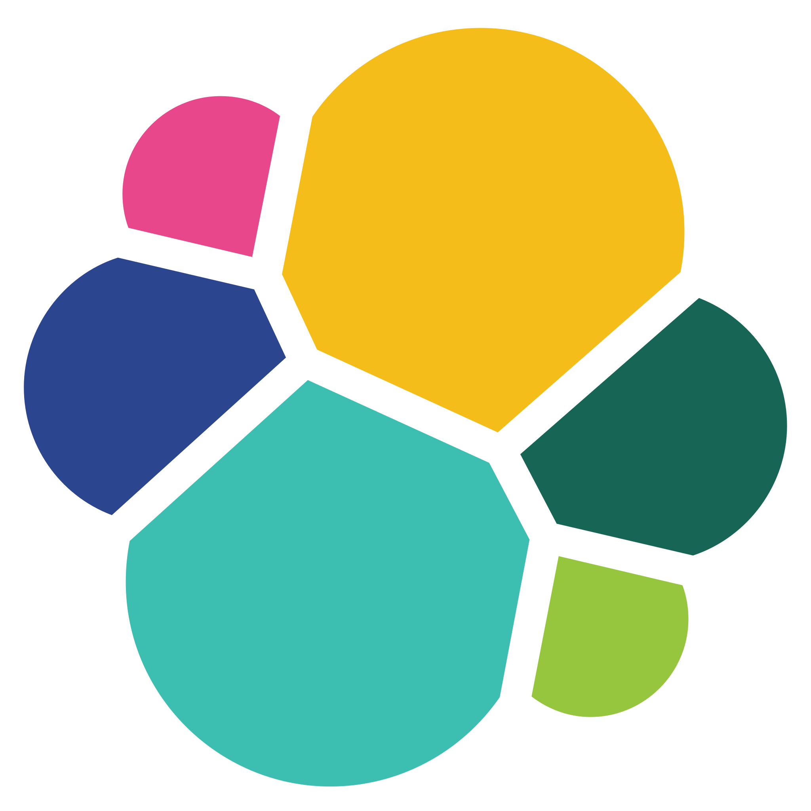
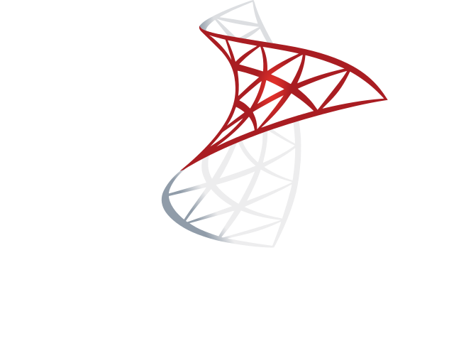
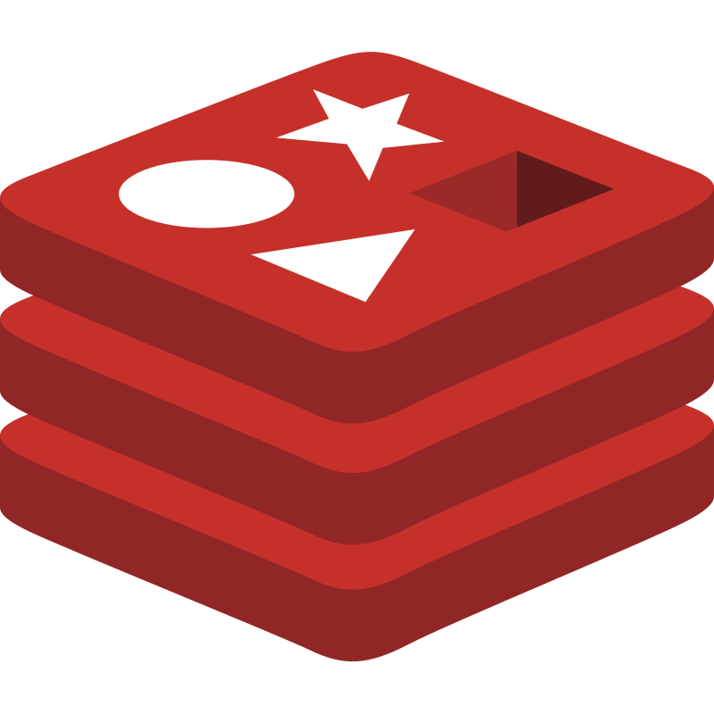
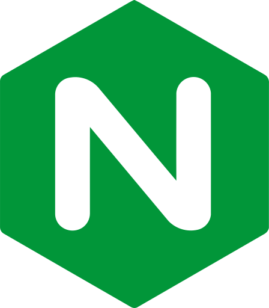

<!-- markdownlint-disable MD033 MD041 MD032 -->

  

<h2 align="center">Shakib Haris</h2>

<b>Founder at <a href="https://brotal.net">Brotal</a> · Software & Systems Engineer</b>

  <i>I build and operate real-world products from data model to deployment.</i>

  
  
  
  
  

  
  
  

---

## 👋 About

- 🏗️ **Founder at [Brotal](https://brotal.net)** — product engineering across software, infrastructure, and operations
- 🧠 **I build systems that stay fast, stay up, and stay secure**
- 🧰 **Code → clusters**: .NET, F#, Python, TypeScript, PostgreSQL, Kubernetes, and automation
- 🔥 **Comfort zone**: product architecture, distributed systems, incidents, performance, hardening, and observability

- 📍 **Dhaka, Bangladesh**
- 🎯 **Product / Platform / Infrastructure**
- 💻 **C# • F# • PowerShell • Bash • Python**
- 📈 **Reliability • Performance • Observability • Cost**

Built and delivered highly available, scalable, real-world ERP, CRM, EdTech, eCommerce, observability, monitoring, and AI systems from scratch — owning the full stack from data modeling to deployment and iterative improvements.

---

## ✨ What I like working on

- ⚡ **Latency & reliability** (hot paths, bottlenecks, load)
- 🔒 **Security by design** (least privilege, secure defaults)
- 📡 **Observability** (signals > noise, faster MTTR)

---

## 🚀 Featured projects

- 📡 **[Chokidar](https://chokidar.app)** — distributed, multi-tenant monitoring with .NET 10, Next.js, PostgreSQL, ClickHouse, and gRPC agents
- 🧠 **[ilma](https://github.com/Brotal-LLC/ilma)** — framework-agnostic agent memory with MCP, pgvector hybrid retrieval, and an Apache AGE knowledge graph
- 📺 **[Brotal TV](https://iptv.shakib.io)** — F#/ASP.NET Core live-TV aggregator with resilient HLS proxying, multi-source channels, analytics, and a React player
- 🃏 **[29](https://29.ekta.dev)** — real-time multiplayer South Asian card game with an F# domain engine, Fable client logic, WebSockets, Three.js, and deterministic bot AI

## 🧩 Open-source

- 🚚 **[Pathao Courier NopCommerce Plugin](https://github.com/skb50bd/nop-plugin-pathao-courier)**
- 🧾 **[Khata (ERP)](https://github.com/skb50bd/khata)**
- 📰 **[Scroll](https://github.com/skb50bd/scroll)**
- 🧮 **[BD Tax Calc (F#)](https://github.com/skb50bd/bxtaxcalc)**

---

## 🛠️ Stack

  
  
  
  
  
  
  
  
  
  
  
  
  
  
  
  
  
  

---

## 🤝 Contact

If you want to chat about infra/platform work:

- 📬 **Email**: [`hello@shakib.bd`](mailto:hello@shakib.bd)
- 🌐 **Website**: [`shakib.bd`](https://shakib.bd)
- 💼 **LinkedIn**: [`linkedin.com/in/skb50bd`](https://linkedin.com/in/skb50bd)

---

  <i>The best code is no code at all. The second best is code that's so simple, it obviously has no bugs.</i>
   
  Dhaka, Bangladesh

